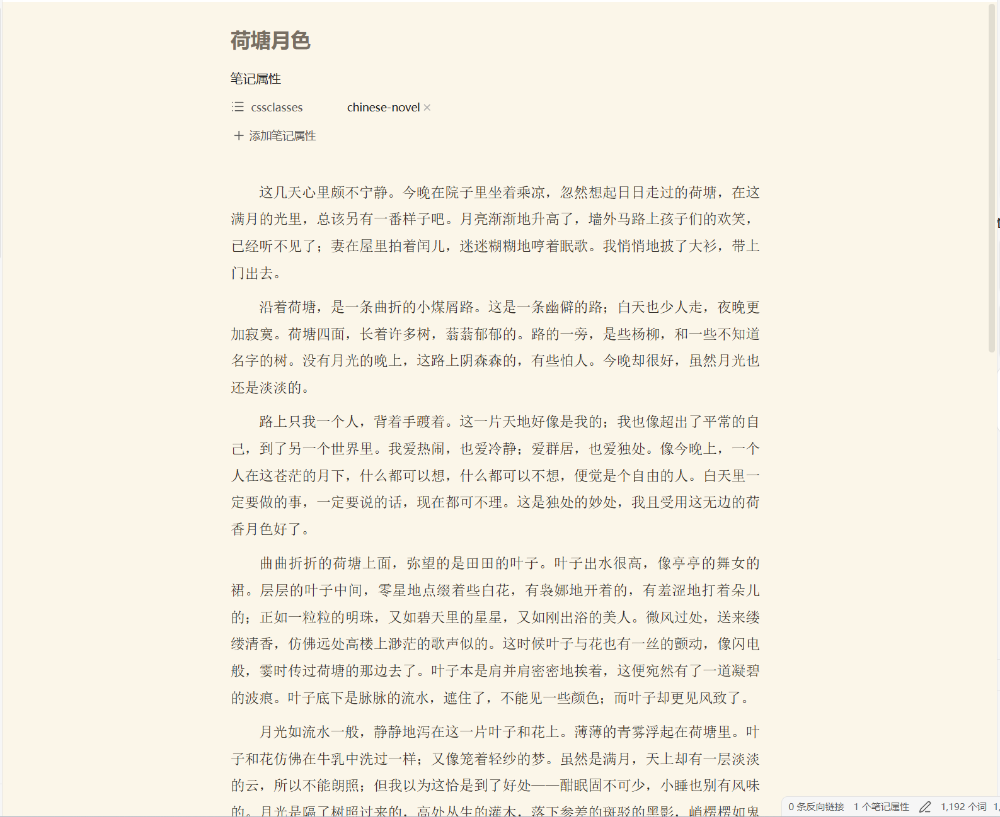
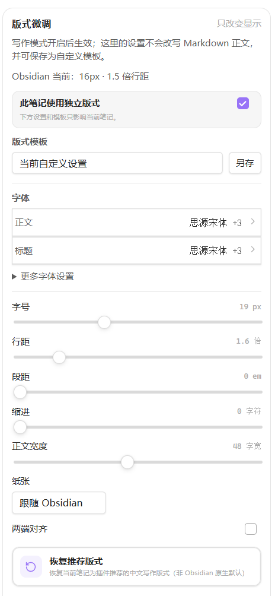
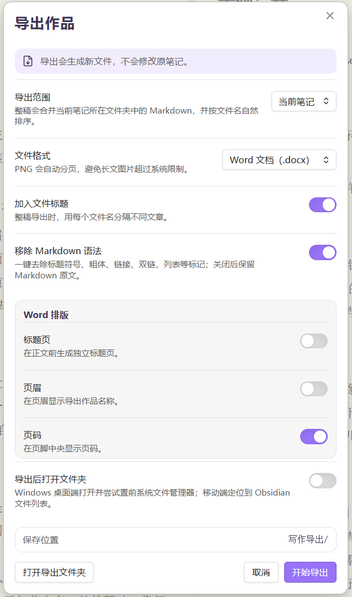

# 中文写作排版

让 Obsidian 更适合写中文长文。

如果你喜欢 Obsidian 的双链、属性和本地 Markdown，希望把日记、笔记、资料和长文尽量留在同一个库里，但又觉得默认排版不太适合中文正文，这个插件就是为这种情况做的。

它不是一套新的小说管理系统，也不会接管人物卡、大纲、场景或文件结构。它只补上一层中文写作需要的排版、文本整理和导出能力，让已经有自己 Obsidian 使用习惯的人，不必为了写长文再换一套软件。

> 当前版本：**0.14.3**  
> 最低 Obsidian 版本：**1.8.0**  
> 当前为试用版本，欢迎反馈实际使用中的问题。


核心使用流程很简单：

**复制进来 → 一键整理 → 写作 → 导出**

其中“写作模式”主要负责显示效果，不会自动改写正文；“一键排版”才会真正整理 Markdown 原文。

## 写作模式：只改显示，不改原文

写作模式用于改善中文长文的阅读和输入体验。它只对开启写作模式的笔记生效，普通笔记保持原来的 Obsidian 样式。

可以调整正文与标题字体、字号、行距、段距、首行缩进、正文宽度、两端对齐和纸张背景。正文、标题、引用、粗体和斜体可以分别设置字体，并按顺序维护后备字体列表；Windows 桌面端还可以读取本机已安装字体。

内置“跟随 Obsidian”和“推荐写作版式”两种基础方案。前者尽量继承当前主题，后者提供一套适合中文长文的起点。调整后的版式可以保存成模板，也可以给某一篇笔记单独设置，或按 `cssclasses` 自动套用不同模板。



开启写作模式后，插件会使用标准属性记录状态：

```yaml
---
cssclasses:
  - chinese-novel
---
```

关闭写作模式后即可移除，不会改动正文内容。

## 一键排版：需要时整理原文

一键排版用于处理从网页、聊天软件或其他地方复制进来的正文，也可以在投稿前统一整理格式。

目前有 19 条可组合规则，主要包括：清理行首行尾和文首文末空白、合并或移除多余空行、整理连续空格、处理中英文之间的空格、添加或移除两个全角空格的段首缩进、全角与半角标点转换、引号转换和省略号规范化。

内置“小说整洁”“紧凑正文”“中文标点整理”三个预设，也可以保存自己的规则组合并调整执行顺序。有选区时只处理选区，没有选区时处理整篇；YAML、围栏代码块和行内代码会尽量避开，操作后可以直接 `Ctrl+Z` 撤销。


## 写作工坊与写作辅助

专业版会打开右侧“写作工坊”，把当前笔记统计、版式、一键排版、写作辅助、校对提示和导出集中在同一个侧栏里；如果只想要最简单的排版，也可以使用简洁版，只保留左侧书本按钮。

除了排版本身，目前还包含几项轻量的写作辅助：

- **打字机模式**：让当前输入行保持在编辑器约 30%～70% 的指定位置，减少视线不断向下移动。
- **高亮当前行**：用柔和背景标出正在输入的这一行，只改变显示。
- **专注模式**：临时隐藏左右侧栏、标签栏和状态栏，按 `Esc` 即可退出。
- **中文写作提示**：检查中文语境中的半角标点、重复标点、未配对引号 / 书名号和手工段首空格。
- **字符统计**：状态栏和写作工坊可以显示当前正文字符数与提示数量，写作工坊中的问题可以点击回到原文位置。

<p align="center">
  
  
</p>

## 字体与纸张

插件内置宋体、黑体、楷体和仿宋的快速字体组合，也可以自己维护字体读取顺序和最后的后备字体。不同格式可以分别指定正文、标题、引用、粗体和斜体字体。

纸张可以跟随 Obsidian，也提供暖色、米白、复古、浅粉、青绿、雾蓝和深色等背景；还可以从当前 Obsidian 库里选择图片作为自定义背景。以上都只影响写作模式的显示，不会写进 Markdown 正文。

## 作品导出

可以导出当前笔记，也可以把当前文件夹中的 Markdown 合并成整稿，并按文件名自然排序。

支持：

- **TXT**：适合投稿、复制和跨软件传递。
- **DOCX**：继承当前正文的字号、行距、段距和首行缩进，并支持标题页、页眉和页码。
- **分页 PNG**：按当前纸张和排版生成自动分页的长文图片。

导出时可以选择是否移除 Markdown 语法。开启后会清理标题符号、粗体、链接、双链、列表、删除线和行内代码等常见标记；关闭后保留 Markdown 原文。两种方式都会排除笔记顶部的 YAML 属性，而且导出只会生成新文件，不会修改原笔记。



## 适合什么样的使用方式

这个插件更适合已经有自己 Obsidian 工作流的人：资料怎么放、人物怎么管、大纲怎么写，都继续按原来的方式来；需要写中文正文时，再给这篇笔记开启写作模式。

如果你需要的是完整的小说项目管理、人物关系、时间线、场景卡或写作计划，这个插件不会替你完成这些事情。它的目标一直比较窄：

**让 Obsidian 里的中文正文进来不乱、写着舒服、出去省事。**

## 安装

前往本仓库的 [Releases](https://github.com/idoncar2/chinese-writing-layout/releases) 下载最新版本。

可以下载发布包，也可以单独下载：

```text
main.js
manifest.json
styles.css
```

将三个文件放进：

```text
<你的 Obsidian 库>/.obsidian/plugins/chinese-writing-layout/
```

不知道自己的 Obsidian 库放在哪里？可以在 Obsidian 左下角点击当前仓库名称，进入“管理仓库”，在那里查看仓库位置。

然后进入 Obsidian：**设置 → 第三方插件 → 中文写作排版**，启用插件。

打开一篇 Markdown 笔记后，点击左侧书本按钮会按下面的顺序切换：

**关闭 → 写作模式（简洁版）→ 写作模式（专业版）→ 关闭**

## 数据与隐私

当前插件围绕本地 Markdown 文件工作，没有正文上传功能。字体扫描只读取系统可用字体名称，不复制或上传字体文件；自定义纸张背景也从当前 Obsidian 库中选择。

本地 `.env`、`data.json`、日志和临时发布包均已排除在 Git 仓库之外。

## 示例

仓库中的 [`examples/小说模式示例.md`](examples/小说模式示例.md) 可以用于快速观察写作模式、中文标点提示和手工缩进提示。

## License

MIT License
