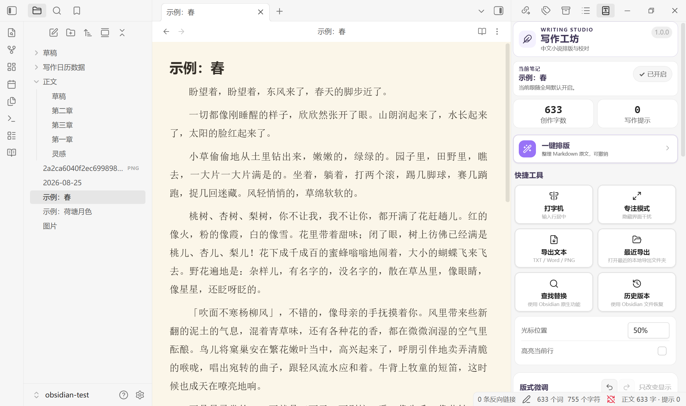
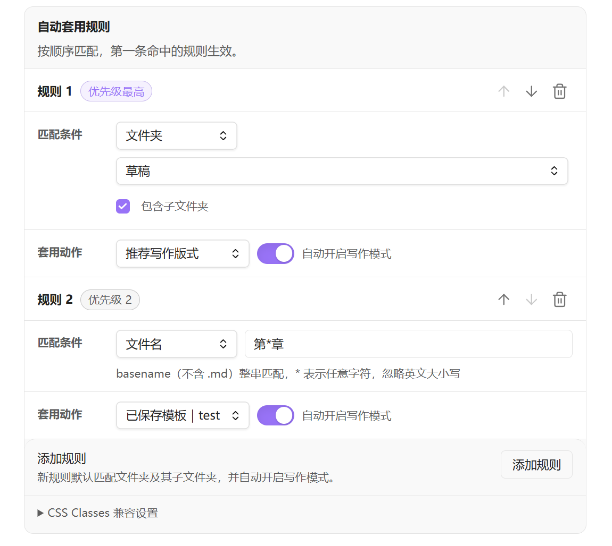
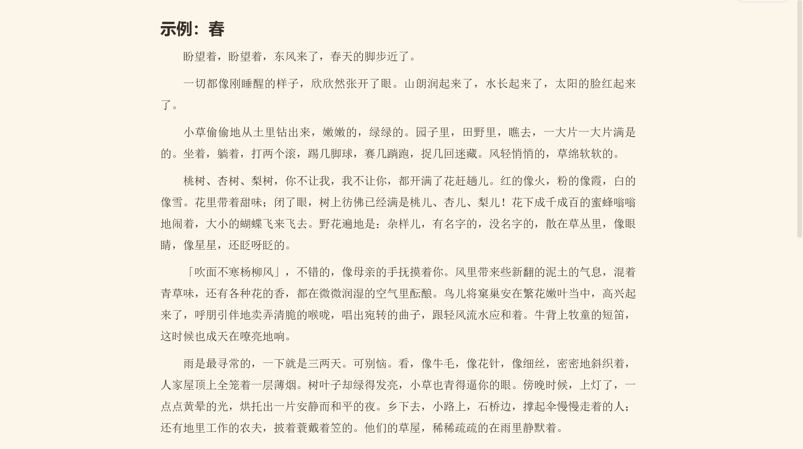
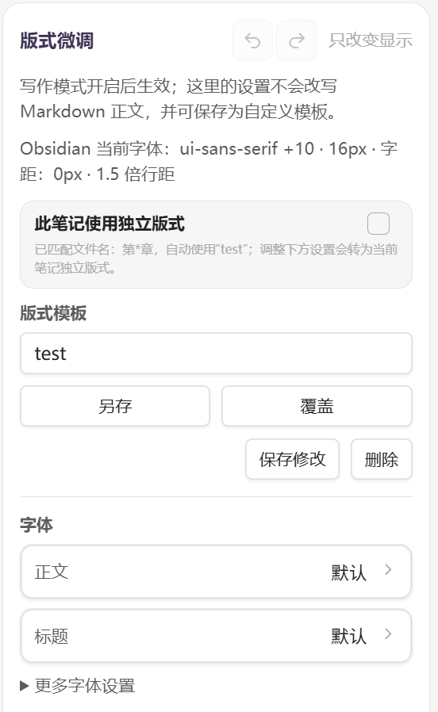
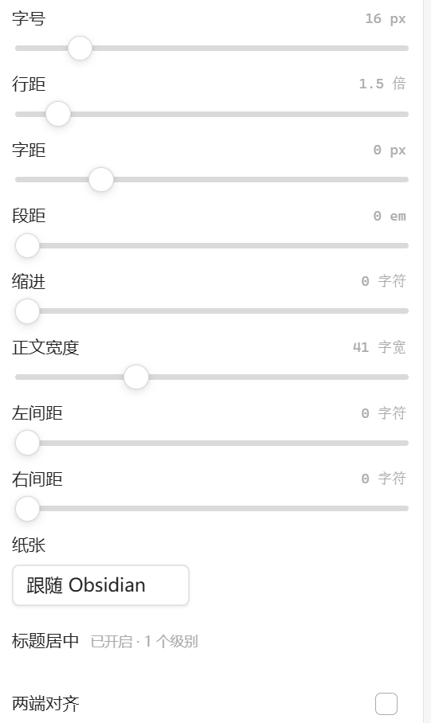
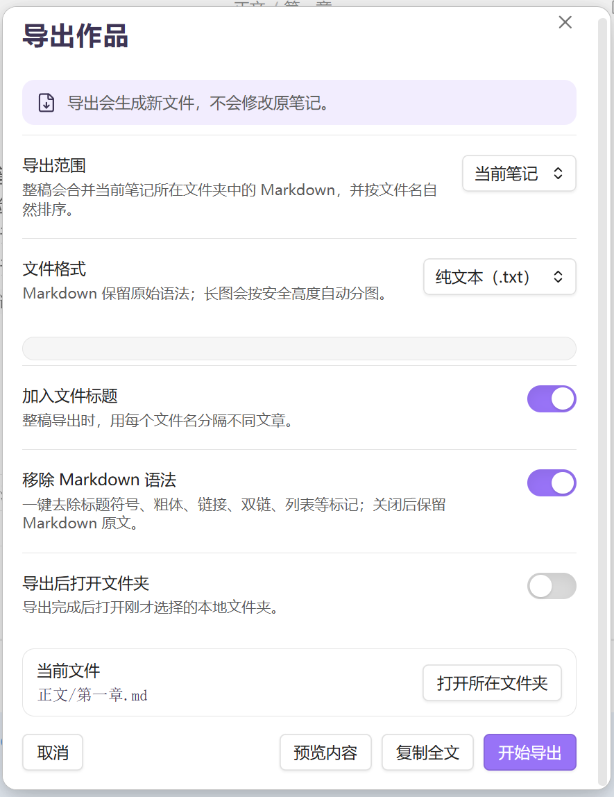

# 中文写作排版

让 Obsidian 更适合中文长文写作。

中文写作排版为本地 Markdown 增加一层可选择的中文排版、文本整理、写作辅助和导出能力。它不会接管人物卡、大纲、项目结构或创作方法；你可以继续使用原来的 Obsidian 工作流，只在需要时开启写作模式。

> 最低支持 Obsidian 1.8.0。写作模式只改变显示；只有明确执行“一键排版”时才会修改 Markdown 正文。



## 主要能力

### 写作模式与自动套用

- 单篇笔记可以选择“跟随自动规则、强制开启、强制关闭”。状态保存在插件数据中，不要求修改 frontmatter。
- 可以设置所有 Markdown 的全局默认状态，并指定默认版式。
- 自动规则支持文件夹、Tag、文件名和 CSS Class；多条规则按设置中的顺序匹配，第一条命中生效。
- 文件夹规则可以包含子文件夹；文件名规则支持普通用户容易理解的 `*` 通配符。
- 旧笔记中的 `chinese-novel`、自定义 `activationClass` 和旧 CSS Class 版式规则继续兼容，插件不会主动删除这些属性。
- 编辑视图、实时预览和阅读视图共用同一套写作模式与版式判定。



书本按钮保留原来的快捷流程：

```text
关闭 → 写作模式（简洁版）→ 写作模式（专业版）→ 关闭
```

如果自动规则已经开启当前笔记，点击关闭会保存为“单篇强制关闭”；需要时可以恢复为“跟随自动规则”。

### 版式与字体

可调整正文、标题、引用、粗体和斜体字体，以及字号、字距、行距、段距、首行缩进、正文宽度、左右留白、两端对齐、标题居中和纸张背景。

- “跟随 Obsidian”会尽量保留当前主题与 Obsidian 的原生设置。
- “推荐写作版式”提供适合中文长文的起点。
- 单篇版式、自定义版式模板和自动规则模板可以同时使用，并遵循清晰的优先级。
- 版式微调支持撤回、恢复和最近历史；这些历史只管理版式，不会进入正文的 `Ctrl+Z` 历史。
- 快捷字体提供宋体、黑体、楷体和仿宋的常见系统候选，不扫描整台电脑；它们依赖当前设备，换系统后外观可能不同。
- 也可以导入 `.ttf`、`.otf`、`.woff` 或 `.woff2` 字体文件。导入后会立即选中并应用，适合需要桌面端与移动端保持一致的情况。字体文件保存在当前插件目录，`data.json` 只保存引用信息。
- 用户字体支持重命名、缺失提示和删除前引用检查；删除后，相关版式会安全恢复为“跟随 Obsidian”或“跟随正文”。

纸张可以跟随 Obsidian，也可以使用暖色、米白、复古、浅粉、青绿、雾蓝、深色或仓库中的自定义背景图片。所有纸张效果都只作用于写作模式。



### 一键排版

一键排版用于整理从网页、聊天软件或其他来源复制进来的文字。它和写作模式不同：执行后会修改选区或当前 Markdown 正文，因此插件会提供明确预览与撤回路径。

现有规则覆盖空白、空行、段首、标点、引号和 Markdown 标记等常见问题。可以使用内置方案、保存自定义方案、调整规则顺序，也可以按手动选择、文件夹或 Tag 批量处理。YAML/frontmatter 与围栏代码块会受到保护。


### 写作辅助

- **打字机模式**：让输入位置保持在视窗约 30%～70% 的指定高度。
- **高亮当前行**：只在显示层提示当前输入行。
- **专注模式**：临时隐藏界面干扰，按 `Esc` 退出。
- **中文写作提示**：检查半角标点、重复标点、未配对引号或书名号、手工段首空格等问题。
- **字符统计**：可选择创作字数或正文字符口径。
- **原生工具入口**：调用 Obsidian 自己的查找替换与文件恢复功能，不重复实现另一套搜索或版本系统。

<p align="center">
  
  
  
</p>

### 内容预览、复制与导出

导出范围可以选择当前笔记或当前文件夹整稿。整稿会读取同一文件夹中的 Markdown，并按文件名自然排序。

- **内容预览**：查看保留或移除 Markdown 后的文本效果。
- **复制全文**：复制纯文本或保留 Markdown 的全文，不生成文件。
- **TXT**：导出纯文本或保留 Markdown 标记的文本。
- **Markdown**：导出保留原始 Markdown 语法的 `.md` 副本或整稿。
- **DOCX**：使用当前版式生成 Word 文档，可选择标题页、页眉和页码。
- **长图 PNG**：选择输出宽度，预览分图计划，并按安全高度生成一组连续图片；移动端按稳定的手机阅读宽度排版，分辨率只改变清晰度，不会套用电脑宽屏的每行字数。

桌面端文件导出使用本地保存对话框，不会在 Obsidian 文件列表中创建导出目录。移动端仍可导出 TXT、Markdown、DOCX 和 PNG，但保存位置固定为当前仓库根目录的 `写作导出/`，不能自定义系统文件夹。两端都不会修改原笔记。



## 桌面端与移动端

写作模式、版式、自动规则、一键排版、写作辅助、内容预览、复制全文和用户字体导入均使用 Obsidian 或 Web API，面向桌面端与移动端设计。

移动端仍可导出，固定保存到当前仓库的 `写作导出/`。以下文件夹操作需要桌面系统的本地对话框或文件管理器，因此在移动端会保留入口但显示为不可用：

- 自定义导出的系统文件夹。
- 打开当前笔记所在的系统文件夹。
- 打开最近一次本地导出目录。

移动端也可以继续使用“内容预览”和“复制全文”。

## 安装

### 从 GitHub Release 手动安装

1. 前往 [Releases](../../releases) 下载 `chinese-writing-layout-版本号.zip`。
2. 解压后确认 `chinese-writing-layout/` 中直接包含：

```text
main.js
manifest.json
styles.css
```

3. 将整个文件夹放到：

```text
<你的 Obsidian 仓库>/.obsidian/plugins/chinese-writing-layout/
```

4. 重启 Obsidian，在“设置 → 第三方插件”中启用 Chinese Writing Layout。

不要下载 GitHub 自动生成的 `Source code` 压缩包。更详细的说明见 [`安装指南.txt`](./安装指南.txt)。

## 数据、隐私与兼容

- 插件围绕本地 Markdown 工作，不上传正文，也不包含遥测或外部网络服务。
- 写作模式状态、版式模板、自动规则和字体元数据保存在插件自己的 `data.json`。
- 用户导入的字体文件保存在插件目录的 `fonts/` 子目录，不会被上传。
- 旧 CSS Class 笔记和旧版设置会继续读取；插件不会批量改写或清理用户的 Markdown 文件。
- 卸载插件后，原始 Markdown 仍然可以由 Obsidian 正常打开。

## 适用边界

这个插件不提供人物管理、世界观、大纲、时间线或小说项目管理。它只解决一条更窄的链路：

**文字进来不乱，写的时候舒服，交稿时省事。**

## 示例

[`examples/小说模式示例.md`](examples/小说模式示例.md) 可以用于快速检查写作模式、中文标点提示和段首缩进。

## English

Chinese Writing Layout is an Obsidian plugin designed for long-form Chinese writing. It adds typography controls, text formatting, writing assistance, and export tools while keeping the original Markdown unchanged unless you explicitly run a formatting command.

### Installation

Install the plugin from the Obsidian Community Plugins directory when it becomes available.

For manual installation, download the latest release and place these files in:

```text
.obsidian/plugins/chinese-writing-layout/
```

Required files:

```text
main.js
manifest.json
styles.css
```

Restart Obsidian, then enable **Chinese Writing Layout** in **Settings → Community plugins**.

### Basic usage

Open a Markdown note and enable Writing Mode from the ribbon button or the Writing Studio panel. You can then adjust typography, fonts, paper style, formatting rules, writing assistance, and export options.

Writing Mode changes only how the note is displayed. The Markdown content is modified only when you explicitly run **One-click Formatting**.

## License

[MIT License](./LICENSE)
